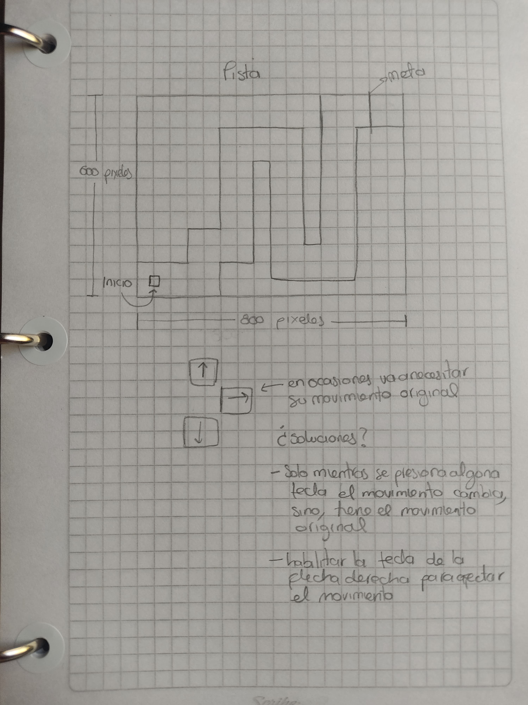
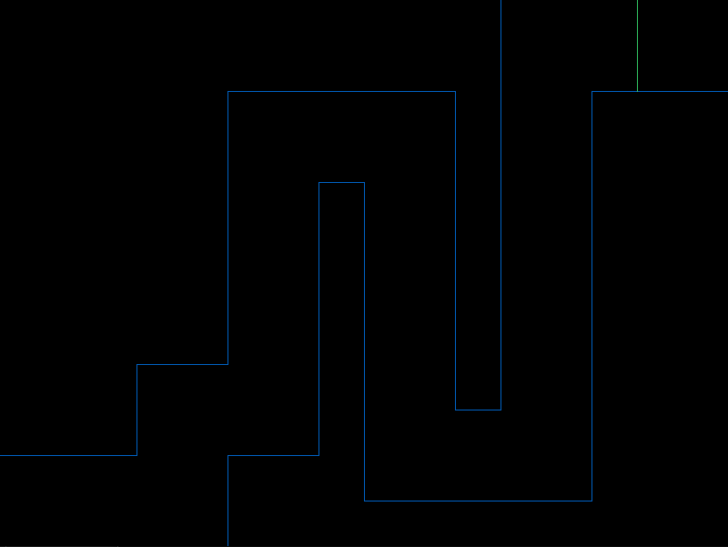
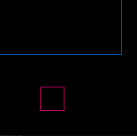

# Juego: atravesar una pista

## Objetivos
- Hacer una pista de un lado a otro de la pantalla mediante líneas.
- Que un cuadrado empiece a moverse hacia la derecha cuando se presione la tecla espacio.
- Que permita guiarlo por la pista con las flechas de arriba y abajo para que llegue al otro lado.
- Si detecta colisiones con las paredes de la pista, que el cuadrado regrese al punto de inicio.
- Hacer que el cuadrado pare automáticamente cuando detecte que ha llegado a la meta.

## Bases para el código
Para este proyecto tomaré de base el código del ercicio cuatro de la actividad pasada, en el que se logra el movimiento de figuras. De igual forma, tomaré el código del ejercicio seis que trata el tema de detección de colisiones.

## Boceto de la pista


## Plan de acción
1. Dibujar la pista.
2. Dibujar el objeto de juego, un cuadrado.
3. Hacer que empiece un movimiento constante hacia la derecha cuando se presione la tecla espacio.
4. Hacer que el cuadrado cambie de dirección si se presionan las teclas UP y DOWN.
5. Hacer que el cuadrado detecte la meta y se detenga.
6. Configurar la detección de colisiones con la pista.

## Desarrollo
1. Dibujar la pista: se necesitan dibujar ocho líneas horizontales y ocho verticales. Pensando en que podría ser útil para luego trabajar la detección de colisiones, cada una tendrá sus propias variables para su punto de inicio y punto de fin. Para ahorrar trabajo usé una estructura y variables que puedan usarla:
    ``` C
    struct linea {
        int x1;
        int y1;
        int x2;
        int y2;
        int width;
        int height;
    } lh1, lh2, lh3, lh4, lh5, lh6, lh7, lh8, lv1, lv2, lv3, lv4, lv5, lv6, lv7, lv8, meta;
    ```
    En el setup() les di sus valores correspondientes y en render() con SDL_RenderDrawLine se dibujaron correctamente.

    

2. Dibujar el cuadrado: previamente creando variables para su posición y tamaño se dibuja en render() con las siguientes líneas
   ``` C
    SDL_SetRenderDrawColor(renderer, 200, 0, 100, 255);
    SDL_Rect rect =
    {
        rectX, //posición en x
        rectY, //posición en y
        rectW, //ancho
        rectH //alto
    };
    SDL_RenderDrawRect(renderer, &rect); // si se quiere relleno, puede usarse SDL_RenderFillRect(renderer, referencia)
   ```
   

3. Hacer que empiece un movimiento constante hacia la derecha cuando se presione la tecla espacio: se obtiene aumentando la posición de manera constante con lo siguiente
    ``` C
    int empezar = 0; // se crea una variable global
     //UPDATE()
     while (SDL_PollEvent(&event)) //mientras que haya un evento
     {
        switch (event.type)
        {
            case SDL_QUIT:
                game_is_running = false;
                break;
            case SDL_KEYDOWN: //si se presiona una tecla
                if (event.key.keysym.sym == SDLK_ESCAPE)
                {
                    game_is_running = false;
                }
                if (event.key.keysym.sym == SDLK_SPACE) // y esa tecla es espacio
                {
                    empezar = 1; // empezar cambia su valor a 1
                }
                break;
        }
     }

     if (empezar ==1) //si ya ha sido presionada la tecla espacio
     {
         rectX += (rectV * delta_time); //el cuadrado se moverá (x = v * t)
     }
    ```

4. Hacer que el cuadrado cambie de dirección si se presionan las teclas UP y DOWN:
   ```C
   int teclaEspacio = 0; // se crea una variable global

   //UPDATE()
   while (SDL_PollEvent(&event))
   {
       switch (event.type)
       {
            case SDL_QUIT:
            game_is_running = false;
            break;
        case SDL_KEYDOWN: // si se presiona una tecla
            if (event.key.keysym.sym == SDLK_ESCAPE)
            {
                game_is_running = false;
            }
            if (event.key.keysym.sym == SDLK_SPACE && teclaEspacio == 0) // y esa tecla es espacio
            {
                teclaEspacio = 1; //variable que asegura que solo se empieza con la tecla espacio
                empezar = 1; //variable que permite saber si se ha presionado la tecla espacio
            }
            if (event.key.keysym.sym == SDLK_UP) // y esa tecla es la flecha hacia arriba
            {
                empezar = 2;
            }
            if (event.key.keysym.sym == SDLK_DOWN) // y esa tecla es la flecha hacia abajo
            {
                empezar = 3;
            }
            if (event.key.keysym.sym == SDLK_RIGHT) // y esa tecla es la flecha hacia la derecha
            {
                empezar = 4;
            }
            break;
        }
    }

    if (empezar == 1) // si se presiona espacio comienza el movimiento
    {
        rectX += (rectV * delta_time);
    }
    if (teclaEspacio == 1 && empezar == 2)
    {
        rectY -= (rectV * delta_time);
    }
    if (teclaEspacio == 1 && empezar == 3)
    {
        rectY += (rectV * delta_time);
    }
    if (teclaEspacio == 1 && empezar == 4) // si se presiona la flecha hacia la derecha pero no se ha presionado espacio, no hay cambios en el movimiento. No obstante, si ya se ha iniciado el juego (presionado la tecla espacio) la flecha derecha si puede intervenir el movimiento del cuadrado
    {
        rectX += (rectV * delta_time);
    }
   ```

5. Hacer que el cuadrado detecte la meta y se detenga: requirió la creación de un condicional
   ```C
   int empezar = 0;
   //UPDATE()
   while (SDL_PollEvent(&event))
   {
       switch (event.type)
       {
            case SDL_QUIT:
            game_is_running = false;
            break;
        case SDL_KEYDOWN: // si se presiona una tecla
            if (event.key.keysym.sym == SDLK_ESCAPE)
            {
                game_is_running = false;
            }
            if (event.key.keysym.sym == SDLK_SPACE && teclaEspacio == 0) // y esa tecla es espacio
            {
                teclaEspacio = 1; //variable que asegura que solo se empieza con la tecla espacio
                empezar = 1; //variable que permite saber si se ha presionado la tecla espacio
            }
            if (event.key.keysym.sym == SDLK_UP && empezar != 0) // y esa tecla es la flecha hacia arriba
            {
                empezar = 2;
            }
            if (event.key.keysym.sym == SDLK_DOWN && empezar != 0) // y esa tecla es la flecha hacia abajo
            {
                empezar = 3;
            }
            if (event.key.keysym.sym == SDLK_RIGHT && empezar != 0) // y esa tecla es la flecha hacia la derecha
            {
                empezar = 4;
            }
            break;
        }
    }

    //Detectar la meta
    if (rectX > (meta.x1 + 10) && rectY > meta.y1 && rectY < (meta.y2 - rectH) ) // para que detecte toda la linea de meta y pare un poco más allá de ella horizontalmente
    {
        empezar = 0;
    }
   ```
6. Configurar la detección de colisiones con la pista.

## Problemas presentados durante el desarrollo
En el desarrollo del punto 4 presenté un inconveniente de lógica, pues el juego iniciaba si se presionaba la tecla espacio, la flecha derecha, la flecha hacia arriba o la de hacia abajo. Después de varios intentos que no daban el resultado esperado, la solución fue crear una variable llamada *teclaEspacio* que iniciara en 0 y que cambiara su valor a 1 cuando se presionara la tecla espacio, también, en la gestión de eventos, la condición ya no es meramente que la tecla presionada sea espacio, sino que también la variable *teclaEspacio* debe ser 0, cosa que solo se cumple si nunca se ha preisonado la tecla espacio. Por último, para que las flechas intervengan en el movimiento del cuadrado, debe haberse presionado la tecla espacio al menos una vez antes de esto.

En el desarrollo del punto 5 también hubo problemas con la lógica. Se seguía detectando que se presionaban las teclas UP, DOWN y RIGHT. La solución fue cambiar los condicionales en la parte de la administración de eventos para que solo afectaran el movimiento si se presionaba la tecla y además, la tecla espacio ya había sido presionada o el cuadrado aún no había pasado la meta.

## Conclusiones